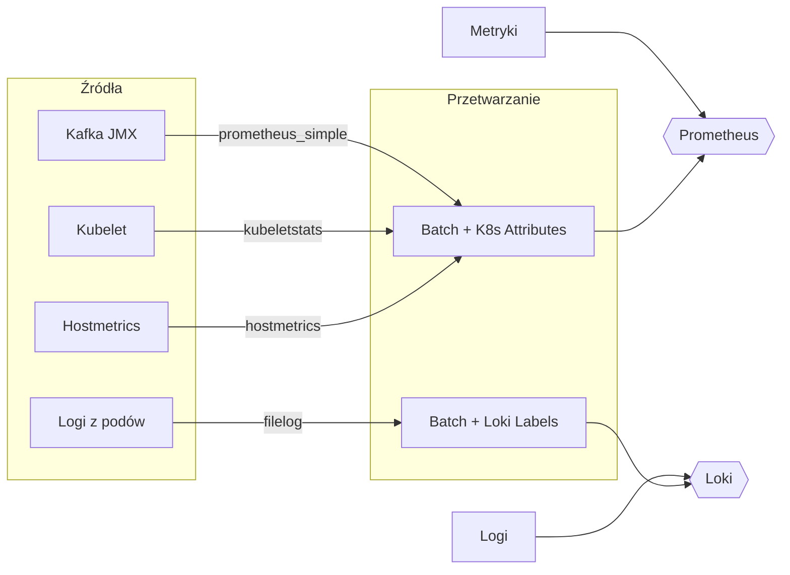

**otel-daemonset** to nic innego jak instancja OpenTelemetry Collector uruchomiona jako Kubernetes DaemonSet. Oznacza to, że na każdym węźle klastra Kubernetes działa osobna kopia tego kolektora[1][5][8].

DaemonSet to kontroler Kubernetes, który gwarantuje, że określony pod (w tym przypadku OpenTelemetry Collector) działa na każdym (lub wybranym) node klastra. 
Dzięki temu każdy node ma własny lokalny kolektor, który zbiera metryki, logi i trace’y z aplikacji oraz infrastruktury działającej na tym samym węźle[1][5][8].

**Główne cechy otel-daemonset:**
- **Działanie lokalne:** Każdy kolektor zbiera dane tylko z węzła, na którym jest uruchomiony (np. metryki z kubeleta, logi z plików systemowych)[1][8].
- **Automatyczna obsługa węzłów:** Jeśli w klastrze pojawi się nowy node, DaemonSet automatycznie uruchomi na nim kolektora; jeśli węzeł zostanie usunięty, pod również zostanie usunięty[6].
- **Wsparcie dla różnych receiverów:** Kolektor może mieć skonfigurowane różne odbiorniki (receivers), np. do zbierania metryk z kubeleta, logów z plików, czy telemetrii z aplikacji przez OTLP[1][4].
- **Optymalizacja przepływu danych:** Aplikacje mogą wysyłać dane do kolektora działającego lokalnie, co zmniejsza opóźnienia i obciążenie sieci[1][8].

**Podsumowanie:**  
otel-daemonset to sposób na uruchomienie OpenTelemetry Collector na każdym węźle klastra Kubernetes, co umożliwia zbieranie metryk, logów i trace’ów blisko źródła danych i zapewnia pełne pokrycie monitoringu infrastruktury[1][6][8].

[1] https://opentelemetry.io/docs/platforms/kubernetes/getting-started/
[2] https://blog.consdata.tech/2024/03/15/czy-wiesz-czym-jest-opentelemetry-i-jak-go-stosowa%C4%87-w-praktyce.html
[3] https://kubernetes.io/pl/docs/concepts/overview/
[4] https://opentelemetry.io/docs/platforms/kubernetes/collector/components/
[5] https://www.youtube.com/watch?v=MMgHFuTbjPk
[6] https://opentelemetry.io/docs/specs/semconv/resource/k8s/
[7] https://aws.amazon.com/blogs/opensource/adding-statefulset-support-in-the-opentelemetry-operator/
[8] https://newrelic.com/blog/how-to-relic/opentelemetry-collector-deployment-modes-in-kubernetes


Oto wyjaśnienie konfiguracji OpenTelemetry Collector w formie sekcji:

## Podsumowanie konfiguracji
Ta konfiguracja OpenTelemetry Collector zbiera metryki i logi z różnych źródeł w klastrze Kubernetes, przetwarza je i eksportuje do Loki (logi) oraz Prometheusa (metryki).

### 1. Receivers (Źródła danych)
**Metryki:**
- **`prometheus_simple/kafka_jmx`**  
  Zbiera metryki JMX z Kafki co 5 sekund z endpointu `otel-kafka-metrics.kafka-cluster.svc.cluster.local:9404/metrics`[1][2]
- **`kubeletstats`**  
  Zbiera metryki z kubeleta (CPU, pamięć, dysk) dla node'ów, podów i kontenerów co 10 sekund[3][1]
- **`hostmetrics`**  
  Zbiera metryki systemowe hosta (CPU, load, pamięć, dyski) poprzez montaż `/hostfs`[3][1]

**Logi:**
- **`filelog`**  
  Zbiera logi z plików w `/var/log/pods/*`, pomijając logi samego otel-collector[4][2].  
  Parsuje formaty logów:
  - **Docker** (JSON)
  - **CRI-O** (regex `time stream logtag`)
  - **containerd** (timestamp w nazwie pliku)

### 2. Processors (Przetwarzanie)
- **`batch`**  
  Grupuje dane w batch'e dla lepszej wydajności
- **`k8sattributes`**  
  Wzbogaca dane o metadane Kubernetes (namespace, nazwa pode, node)[5][3]
- **`resource/filelog`**  
  Dodaje etykiety Loki: `pod`, `namespace`, `container` dla lepszej organizacji logów[4][2]

### 3. Exporters (Miejsca docelowe)
- **`otlphttp/loki`**  
  Wysyła logi do Loki przez endpoint `http://loki.loki:3100/otlp` w formacie OTLP[4][2]
- **`otlphttp/prometheus`**  
  Wysyła metryki do Prometheusa przez endpoint `http://prometheus-server.prometheus:80/api/v1/otlp`[1][2]
- **`debug`**  
  Pokazuje szczegółowe informacje o danych dla diagnostyki

### 4. Service Pipelines (Przepływy danych)


## Kluczowe elementy
1. **Integracja z Kafka**  
   Specjalny receiver dla metryk JMX z Kafki, co wymaga wcześniejszego wystawienia endpointu `/metrics`[1][2]

2. **Automatyczne tagowanie Kubernetes**  
   Procesor `k8sattributes` dodaje metadane jak:
   ```python
   resource:
     k8s.namespace.name: "monitoring"
     k8s.pod.name: "grafana-xyz"
     k8s.node.name: "node-01"
   ```

3. **Parsowanie logów w różnych formatach**  
   Mechanizm routera rozróżnia formaty logów przez wyrażenia regularne:
   ```python
   if body.startswith("{"):  # Docker
   elif "Z" in timestamp:    # containerd
   else:                     # CRI-O
   ```

4. **Optymalizacja dla Loki**  
   Dodawanie etykiet `pod` i `namespace` w procesorze `resource/filelog` pozwala na efektywne zapytania w Loki[4][2]

## Potencjalne problemy
- **Autoryzacja kubelet**  
  Konfiguracja `auth_type: serviceAccount` wymaga poprawnego RBAC dla ServiceAccount otel-collector[3][1]
- **Format OTLP w Prometheus**  
  Wymaga wersji Prometheusa z obsługą OTLP (np. v3.x+)[1][2]
- **Mount /hostfs**  
  Kontener otel-collector musi mieć zamontowany system plików hosta (`/hostfs`) do zbierania metryk systemowych[1]

[1] tools.metrics_collection
[2] programming.terraform
[3] tools.kubernetes_networking
[4] tools.system_logging
[5] tools.kubernetes_monitoring


kafka jmx - Kafka JMX to zbiór metryk monitorujących działanie Kafki, udostępnianych przez interfejs JMX.